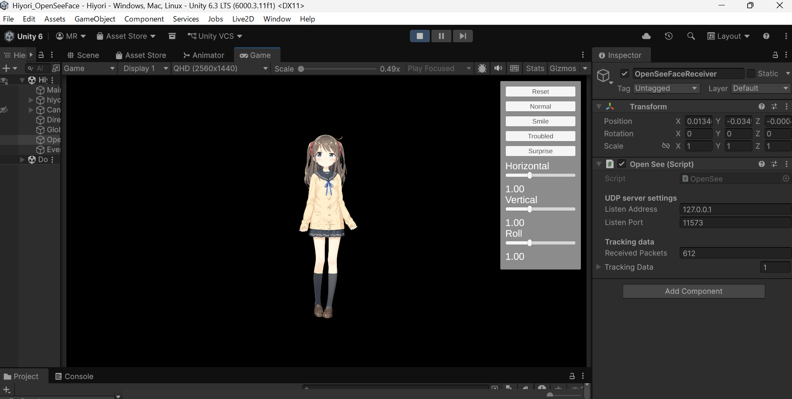

# Unity × Live2D × OpenSeeFace Facial Tracking



OpenSeeFaceからフェイストラッキングデータをUDPで受信し、Unity上のLive2Dモデルへリアルタイムに反映する個人制作です。

> Live2DモデルにはLive2D公式サンプルモデル「Hiyori」を使用しています。  
> 本リポジトリでは、自身で実装・調整したC#スクリプトを公開しています。

## 概要

Webカメラから取得した顔情報をOpenSeeFaceで解析し、そのトラッキングデータをUnityで受信して、Live2D Cubism SDK for Unityを使用してモデルのパラメータへ反映しています。

UnityとLive2Dの学習の一環として、外部のフェイストラッキングシステムとUnityを連携させ、リアルタイムにキャラクターを動かすことを目的に制作しました。

## 実装した機能

- OpenSeeFaceからのUDPデータ受信
- 顔の上下・左右方向の動きの反映
- 顔の傾き（Roll）の反映
- 左右のまばたき
- 口の開閉
- 表情パラメータの制御
- トラッキング感度の調整
- 表情切り替えUI
- 感度調整UI

## 使用技術

- Unity
- C#
- Live2D Cubism SDK for Unity
- OpenSeeFace
- Webカメラ
- UDP通信

## システム構成

フェイストラッキングデータは、以下の流れでLive2Dモデルへ反映しています。

```text
Web Camera
    ↓
OpenSeeFace
    ↓
UDP
    ↓
Unity / C#
    ↓
Live2D Cubism SDK
    ↓
Live2D Model
```

OpenSeeFaceで取得した顔情報をUDPでUnityへ送信し、受信した値をLive2Dモデルの各パラメータに変換して反映しています。

## 工夫した点・解決した問題

### 顔の上下方向の補正

OpenSeeFaceから取得した値をそのままモデルへ反映すると、実際の顔の上下方向とLive2Dモデルの動きが逆になる問題がありました。

取得値とモデルの挙動を確認し、値の向きを補正することで、実際の顔の動きとモデルの動きを一致させました。

### まばたきの調整

OpenSeeFaceから取得した目の開閉値をそのまま使用すると、目を閉じてもLive2Dモデル側では完全に閉じない場合がありました。

実際の開眼時・閉眼時の値を確認し、取得値をLive2D側で使用するパラメータ範囲に合わせて変換する処理を調整しました。

### トラッキング感度の調整

ユーザーやカメラ環境によって顔の動きの大きさが異なるため、Horizontal・Vertical・Rollの感度をUnity上のUIから調整できるようにしました。

値を変更するとリアルタイムでモデルの動きへ反映されます。

### 表情切り替えUI

動作確認をしやすくするため、Unity上から表情を切り替えられるUIを実装しました。

現在は以下の表情を切り替えられます。

- Normal
- Smile
- Troubled
- Surprise

## Scripts

このリポジトリでは、自分が実装・調整した以下のC#スクリプトを公開しています。

### `OpenSee.cs`

OpenSeeFaceから送信されるデータをUDPで受信し、Unity側で利用できる形にする処理を担当します。

### `FaceRotationTest.cs`

OpenSeeFaceから取得した顔の回転情報をLive2Dモデルへ反映する処理を担当します。

### `ExpressionController.cs`

まばたき、口の開閉、表情など、Live2Dモデルの表情に関する制御を担当します。

### `SensitivityUI.cs`

Horizontal・Vertical・Rollなど、トラッキング感度をUIから変更する処理を担当します。

### `ControlPanelController.cs`

表情切り替えなど、設定用UIの制御を担当します。

## このリポジトリについて

このリポジトリは、制作したUnityプロジェクト全体ではなく、自身で実装・調整したコードをポートフォリオとしてまとめたものです。

Live2D Cubism SDK、Live2D公式サンプルモデルなどの第三者アセットは、このリポジトリには含めていません。

## 今後追加したい機能

- トラッキングの安定性向上
- 表情認識の拡張
- UIの改善
- 設定値の保存・読み込み
- より自然な顔・目・口の動きへの調整

## 制作を通して学んだこと

この制作を通して、UnityとC#の基本的な実装だけでなく、外部アプリケーションから送信されたデータをUnityで受信し、その値をキャラクター制御に利用する流れを学びました。

また、実装した処理が想定通りに動かない場合に、取得している値やUnity上での挙動を確認しながら原因を切り分け、補正・調整を行う経験ができました。

## Status

現在も学習・改善を継続しています。